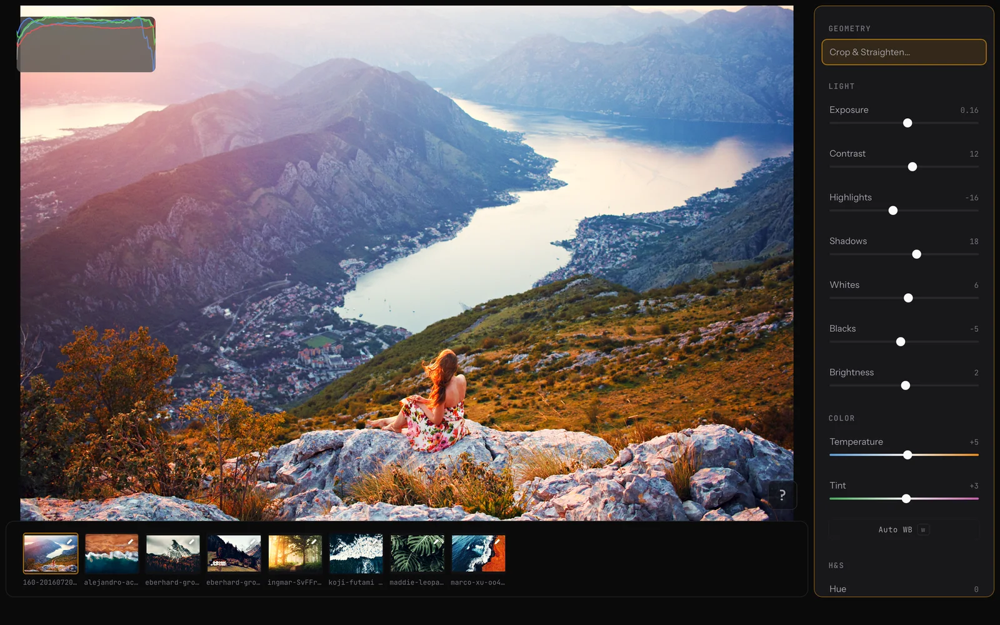

# Darkslide

A fast, free, keyboard-first photo editor for macOS. Local-only, non-destructive, no subscription and no account.



▶ **[Watch the demo](https://youtu.be/4R9l4fgsvT4)** · **[Darkslide website](https://darkslide.app)**

## Why I built this

I wanted to experiment with idea for keyboard-first photo editor from UX perspective. Every tool can be used with just keyboard shortcuts or keyboard navigation. Mouse is supported as well. Also, I wanted to focus on speed of the application, but also workflow speed: responsive app, no useless blocking animations, rendering, import and export speed. 
Also, I personally hate managing some .library file and think where photos are located. So the app can store adjustments even when photos where moved to another place and it can still load editings without any additional actions.

To iterate the goals were simple:
- **Fast** — the app and the workflow. Previews should feel instant, and editing the next photo should not be blocked by some loading or app animation.
- **Keyboard-first, mouse-friendly** — vi-style navigation (with arrows fallback) is the fastest way to jump between adjustments, make changes or navigate inside the app.
- **Local and non-destructive** — never change the original file
- **No library management** - automatically track if photos were moved somewhere else and preserve editing (e.g., you edit image via the app, then moved original file somewhere - Darkslide will understand that). And to have some tmux-style sessions so you can quickly jump between them.
- **Free** — no subscription, no account, no paywalled features.

Darkslide is that tool.

## What it does

**Color**
- 3-way Color Balance (shadows / midtones / highlights)
- Selective Color — an 8-channel HSL mixer
- Per-channel tone curves (RGB / R / G / B)
- Auto white balance, plus as-shot white balance read from EXIF
- Exposure, contrast, highlights, shadows, whites, blacks, brightness, temperature, tint, hue, saturation, vibrance

**Geometry**
- Crop and straighten
- Perspective correction (vertical / horizontal)
- Lens distortion correction

**Detail**
- Bilateral denoise
- Film-style grain
- Texture, clarity, and sharpening

**Workflow**
- Persistent editing sessions (tmux-style palette)
- Copy/paste adjustments across a batch
- Undo/redo for adjustments and for removing images
- Filmstrip multi-selection (Shift-click, ⌘-click) with a context menu
- Fullscreen filmstrip grid
- Bulk export with live progress, preserving EXIF
- LUT import and management (`.cube`)
- Full macOS menu bar with keyboard parity and an in-app shortcut reference (`?`)

## Design principles

- **Non-destructive**: original files are never modified; edits are stored separately and applied at render/export time.
- **Keyboard-first**: every action has a binding, driven from a single command registry so shortcuts, the menu bar, buttons, and context menus stay in sync.
- **GPU-accelerated**: previews and thumbnails are computed on the GPU, prioritized so slider drags stay fluid even on large files.
- **Local**: no account, no uploads.

## Technical details

- **Shell**: [Tauri v2](https://tauri.app/) — Rust backend with the system webview (WKWebView on macOS).
- **Frontend**: Preact 10 + TypeScript, bundled with Vite. Preact runs through `preact/compat`, so components use `react` imports without shipping React.
- **State**: Zustand stores; Immer for immutable updates.
- **Rendering core** (`darkslide-core`): a strictly GPU pipeline built on [wgpu](https://wgpu.rs/)  with WGSL compute shaders. Color grading and film grain are fused into a single 3D-LUT pass; detail filters (texture, clarity, sharpening, denoise) run as separable passes; geometry (straighten, zoom/crop, perspective, distortion) is an inverse-affine GPU pass. Image decode/encode uses hardware-accelerated and SIMD paths.
- **Persistence**: SQLite (via `rusqlite`) stores per-image adjustments keyed by a stable image identity, plus editing sessions. Images are resolved to stable UUIDs (with move/duplicate/UUID-heal handling).
- **Command architecture**: a single `commandDefinitions` registry maps every action to its label, accelerator, badge, and key predicate. Execution is centralized in `ActionService`, and the macOS menu bar emits the same command ids — so there is one source of truth for keyboard, menu, and pointer paths.
- **Performance work**: coalesced preview renders with stale-response dropping, virtualized filmstrip (line + grid), a unified LRU thumbnail cache, progressive two-pass thumbnails (fast draft → view-aware HQ), adjacent-preview prefetching, and dedicated preview/thumbnail GPU channels so thumbnails never starve slider previews.
- **Editing sessions**: every open auto-creates a persistent session (image list only); attaching a session reloads the view. Adjustments ride along via the image identity.
- **Undo/redo**: in-memory, per image, with rapid edits coalescing into single steps.

## Getting started

Requires macOS, [Rust](https://rustup.rs/), and [Bun](https://bun.sh/).

```bash
bun install

bunx tauri dev      # run the full desktop app
bun run ui:dev      # run only the Vite frontend
bun run build       # type-check + build the frontend
bun run test        # Vitest + Rust workspace tests
```

Build a distributable DMG (signed; notarization is skipped unless configured):

```bash
npm run app:dmg     # → dist-dmg/Darkslide.dmg
```

## Installation

Get the latest build from **[darkslide.app](https://darkslide.app)** (or the [releases page](https://github.com/RomanVolkov/darkslide/releases)).

The release DMG is code-signed but **not notarized**, so first launch may show a Gatekeeper warning. Remove the quarantine attribute after dragging the app to Applications:

```bash
xattr -dr com.apple.quarantine /Applications/Darkslide.app
```

Alternatively, right-click the app and choose **Open** once.

## License

MIT — see [LICENSE](LICENSE).
